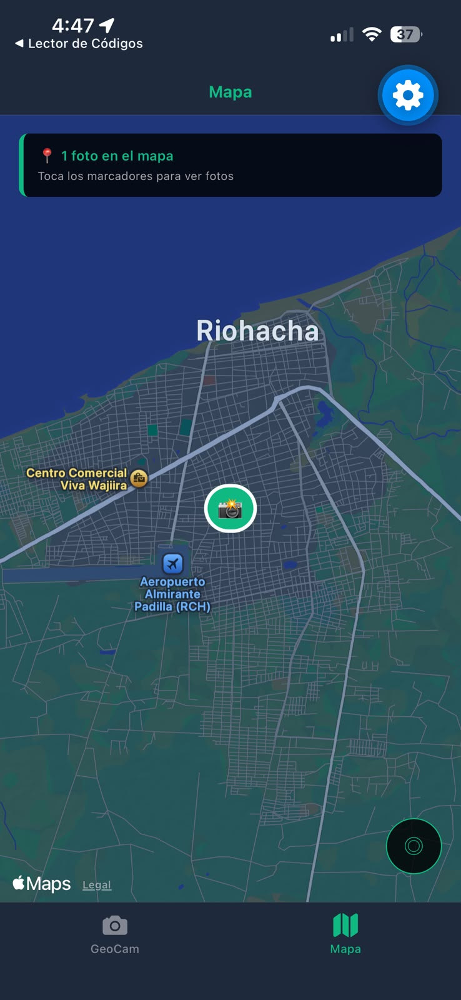
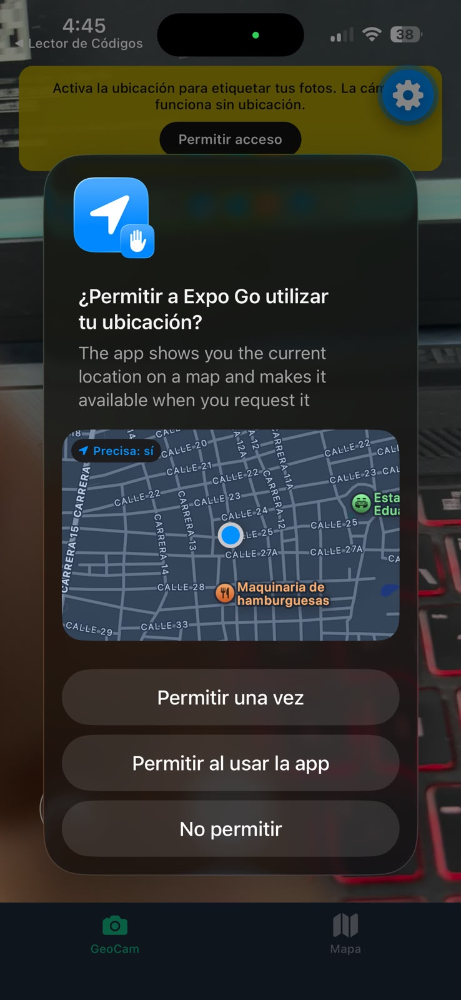
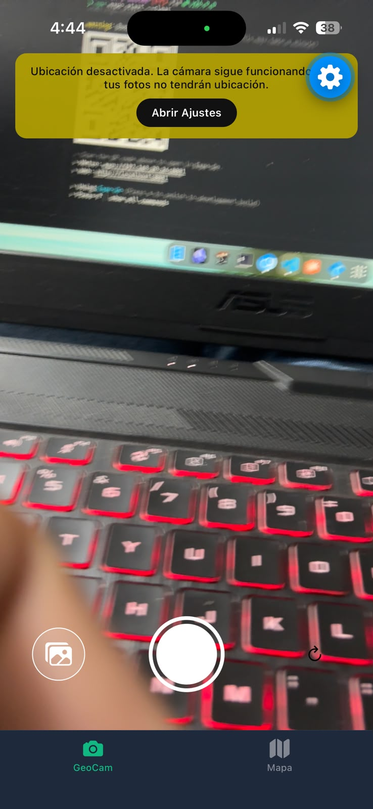
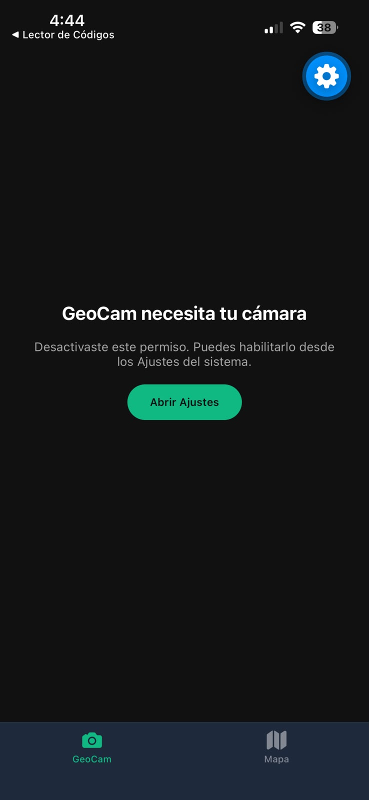
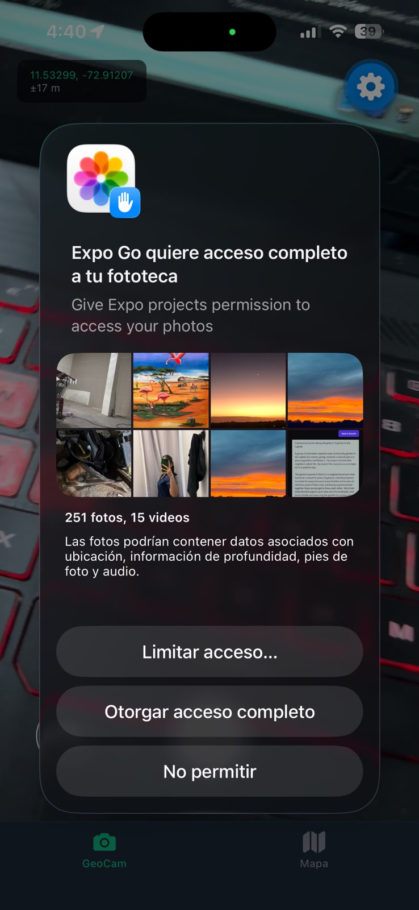
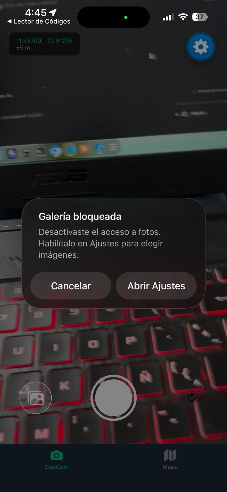
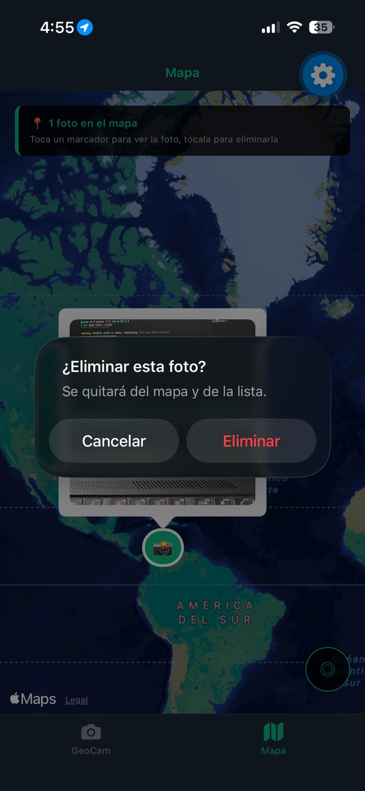

# GeoCam persistente — Semanas 6 y 7

Una cámara inteligente que etiqueta cada foto con coordenadas GPS y reacciona al movimiento del teléfono, construida con Expo SDK 57 y Custom Hooks tipados. Desde la Semana 7, las fotos y sus coordenadas **sobreviven al cierre de la app** gracias a SQLite con Drizzle ORM (offline-first).

## Características

### Pantalla GeoCam
- **Cámara en vivo** con toggle front/back
- **Ubicación en tiempo real** mostrando coordenadas y precisión
- **Captura de fotos** con degradación elegante
- **Importar desde galería** (botón inferior izquierdo) con permiso en contexto
- **Banner inteligente** que pide ubicación sin bloquear la cámara
- **Agitar para borrar** todas las fotos con confirmación
- **Borrar una foto**: mantén presionada la miniatura en GeoCam, o toca la foto del marcador en Mapa

### Pantalla Mapa
- **MapView interactivo** con markers de cada foto
- **Miniaturas clickeables** de las fotos en los markers
- **Información de ubicación** (coordenadas y precisión)
- **Grid de fotos** sin ubicación

### Pantalla Fotos (lista + filtros)
- **Buscador por nota** (`like`) y filtros por **álbum** y **favoritas**
- La consulta se reconstruye con `useLiveQuery(consulta, [busqueda, albumId, soloFavoritas])`: todo se recalcula solo
- Crear álbumes (nombre único) desde la misma pantalla
- Toca una foto para abrir su detalle

### Detalle de foto (`app/foto/[id].tsx`)
- Ver foto, **editar nota**, **marcar favorita**, **mover de álbum**
- **Eliminar con confirmación** (borra el registro SQLite y su archivo)

### Base de datos local offline-first (Semana 7)
- **SQLite** (`expo-sqlite`) + **Drizzle ORM** (`drizzle-orm/expo-sqlite`)
- Dos migraciones generadas con `drizzle-kit generate`, ninguna editada a mano:
  - `0000`: tabla `photos` (uri, coordenadas opcionales, source, fecha)
  - `0001` (aditiva: los datos anteriores se conservan): tabla `albums` + columnas `album_id`, `note`, `favorite`
- `useMigrations` protege el layout raíz: sin tablas aplicadas, no hay UI
- `useLiveQuery` con `enableChangeListener: true`: listas, mapa y totales se actualizan solos
- Archivos permanentes: al guardar se copia de caché a `documentos/photos/`; al borrar el registro se borra el archivo
- Funciona en **modo avión** y tras **cerrar Expo Go por completo**

#### Diagrama de tablas

```
albums                          photos
┌──────────────┐    ┌─────────────────────────────────┐
│ id PK AI     │◄───│ id PK AI                        │
│ name UNIQUE  │    │ uri NOT NULL                    │
│ created_at   │    │ latitude REAL (nullable)        │
└──────────────┘    │ longitude REAL (nullable)       │
                    │ accuracy REAL (nullable)        │
  Borrar un álbum → │ source camera|gallery NOT NULL  │
  fotos con         │ album_id FK → albums(id)        │
  album_id = NULL   │   (al borrar álbum: SET NULL)   │
  (no se borran)    │ note TEXT (nullable)            │
                    │ favorite INTEGER bool DEF false │
                    │ created_at                      │
                    └─────────────────────────────────┘
```

### Permisos Robustos
- **Máquina de estados**: checking → undetermined → granted/denied/blocked
- **Pantalla PermissionPrimer** que explica antes de pedir
- **Botón "Abrir Ajustes"** cuando el permiso está bloqueado
- **Degradación elegante**: sin ubicación → foto sin coords

## Requisitos Implementados

### R1. Estado Global
- `GeoPhotosContext.tsx` con `addPhoto`, `removePhoto`, `clearAll`
- Provider en root layout

### R2. Importar desde Galería
- `hooks/useGallery.ts` con `useMediaLibraryPermissions()` (permiso en contexto) y `launchImageLibraryAsync({ mediaTypes: ['images'] })`
- Botón de galería en GeoCam (ícono, o miniatura de la última foto para elegir otra)
- Degradación elegante: sin ubicación se guarda con `coords: null`, `source: 'gallery'`

### R3. Pestaña Mapa
- MapView con Markers para cada foto
- Miniaturas en los markers
- Fotos sin ubicación listadas aparte

### R4. useShake Hook
- Detecta agitado con `Accelerometer`
- Pregunta antes de borrar todas las fotos
- Cooldown de 1.5s para evitar borrados accidentales

### R5. AI-LOG
- Registro de prompts, correcciones y alucinaciones

## Instalación y Ejecución

```bash
cd geocam
npx expo install
npx expo start -c
```

> Usa `-c` (limpiar caché) la primera vez: Babel y Metro deben registrar el
> plugin `inline-import` y la extensión `.sql`. Si ves "no such table", la
> migración no se aplicó: reinicia con `npx expo start -c`.

Escanea el código QR con **Expo Go** en tu teléfono físico.

> **Nota**: La cámara NO funciona en simulador iOS. Necesitas un teléfono físico con Expo Go.

## Estructura de Archivos

```
drizzle/
├── 0000_cool_harry_osborn.sql   # Migración 1: tabla photos
├── 0001_jazzy_tattoo.sql        # Migración 2 (aditiva): albums + note/favorite/album_id
├── meta/                        # Journal de drizzle-kit (versionado)
└── migrations.js                 # Bundle de migraciones (generado, no editar)
src/
├── app/
│   ├── _layout.tsx              # Root layout: aplica migraciones con useMigrations
│   ├── index.tsx                # Redirect a GeoCam
│   ├── foto/[id].tsx            # Detalle: nota, favorita, álbum, eliminar
│   └── (tabs)/
│       ├── _layout.tsx          # Tab navigator (GeoCam + Mapa + Fotos)
│       ├── geocam.tsx           # Pantalla cámara (usa usePhotos)
│       ├── mapa.tsx             # Pantalla mapa (usa photosWithLocation)
│       └── fotos.tsx            # Lista con búsqueda y filtros
├── db/
│   ├── schema.ts                # Tablas photos + albums y relaciones
│   ├── client.ts                # openDatabaseSync + PRAGMA foreign_keys
│   └── repositories/
│       ├── photos.ts            # listQuery, withLocationQuery, CRUD, filtros
│       └── albums.ts            # CRUD de álbumes (borrado con SET NULL explícito)
├── hooks/
│   ├── usePhotos.ts             # photos, photosWithLocation, add/remove/update/clearAll
│   ├── useAlbums.ts             # Lista y CRUD de álbumes
│   ├── useGeoLocation.ts        # GPS + permisos + limpieza
│   ├── useCamera.ts             # Cámara + permisos
│   ├── useGallery.ts            # Galería + permiso de fotos
│   └── useShake.ts              # Acelerómetro para agitado (borra vía clearAll)
├── services/
│   └── photoFiles.ts            # Copia caché→documentos, borrado de archivos
├── components/
│   └── PermissionPrimer.tsx     # Pantalla de permisos
└── types/
    └── geo.ts                   # Coords, GeoPhoto (id numérico de SQLite), LocatedPhoto
```

## Estados de Permiso

Capturas tomadas en dispositivo físico (iPhone + Expo Go).

### Estado: Concedido (granted)



Mapa centrado en Riohacha con marcador de foto geolocalizada: flujo completo con ubicación concedida (coordenadas en vivo `±5 m` en GeoCam).

| | |
|---|---|
| **Cómo reproducirlo** | Aceptar el diálogo del sistema al pedir cámara / ubicación |
| **Qué se ve** | Cámara activa, coordenadas en vivo (`±X m`), botón de captura funcional |
| **Código** | `camPermission === 'granted'` → render de `CameraView` (`geocam.tsx`); `geo.coords` en vivo por `watchPositionAsync` |

### Estado: Rechazado (denied)



Diálogo del sistema pidiendo ubicación con el aviso *"Activa la ubicación para etiquetar tus fotos. La cámara funciona sin ubicación."* y botón **Permitir acceso** detrás.

| | |
|---|---|
| **Cómo reproducirlo** | Negar **una vez** el diálogo del sistema (aún se puede volver a pedir) |
| **Qué se ve (ubicación)** | Aviso amarillo: *"Activa la ubicación para etiquetar tus fotos. La cámara funciona sin ubicación."* + botón **Permitir acceso**. La cámara **sigue funcionando** y la foto se guarda con `coords: null` |
| **Qué se ve (cámara)** | Pantalla `PermissionPrimer` + botón **Permitir acceso** |
| **Código** | `permission === 'denied'` → `canAskAgain === true`, se puede re-llamar `requestPermission()` |

### Estado: Bloqueado (blocked)



Ubicación desactivada: aviso amarillo *"La cámara sigue funcionando, pero tus fotos no tendrán ubicación."* con botón **Abrir Ajustes**.

Cámara bloqueada (`PermissionPrimer` con el mismo botón):



### Extras

Permiso de fototeca al importar desde galería:



Galería bloqueada con botón **Abrir Ajustes**:



Borrado individual desde el marcador del mapa:



| | |
|---|---|
| **Cómo reproducirlo** | Negar **dos veces** (Android ya no muestra el diálogo) o desactivar el permiso en Ajustes del sistema |
| **Qué se ve (ubicación)** | Aviso: *"Ubicación desactivada. La cámara sigue funcionando..."* + botón **Abrir Ajustes** → `Linking.openSettings()` |
| **Qué se ve (cámara)** | `PermissionPrimer` con texto *"Desactivaste este permiso..."* + botón **Abrir Ajustes** |
| **Código** | `canAskAgain === false` → `mapPermission()` retorna `'blocked'` (`useGeoLocation.ts`, `useCamera.ts`) |

### Cómo tomar las capturas

1. `npx expo start` y abrir en Expo Go (teléfono físico).
2. **Rechazado**: instalación fresca → negar el diálogo una vez → captura.
3. **Bloqueado**: negar dos veces, o ir a Ajustes → revocar el permiso → volver a la app → captura.
4. **Concedido**: aceptar el diálogo → captura con coordenadas visibles.

## Verificación Previa a Entrega

- [x] Hooks tipados sin `any`
- [x] Permisos en contexto (no al abrir la app)
- [x] Sin ubicación → cámara sigue funcionando
- [x] Botón "Abrir Ajustes" en estado blocked
- [x] Suscripciones limpias al salir (GPS/acelerómetro gated por `isFocused` + `remove()` en cleanup; cámara desmontada sin foco)
- [x] Errores llegan a la UI como estado
- [x] useGeoLocation, useCamera, useShake implementados
- [x] AI-LOG.md documentado

## Verificación previa a entrega (Semana 7)

- [x] Dos migraciones generadas con `drizzle-kit generate`, ninguna editada a mano
- [x] Las fotos de antes de la segunda migración se conservan (migración aditiva)
- [x] Las pantallas no importan Drizzle: solo el layout raíz (`useMigrations`) y los repositorios
- [x] Crear, leer, actualizar y borrar funcionan; los filtros se actualizan solos (`useLiveQuery`)
- [x] Las fotos se guardan en documentos y se borran junto con su registro
- [x] `npx tsc --noEmit` → 0 errores; lint limpio salvo error pre-existente del template
- [x] README.md y AI-LOG.md en la raíz; carpeta `drizzle/` versionada

### Guion de verificación en dispositivo (T6)
1. Toma tres fotos (alguna sin ubicación: niega el GPS una vez).
2. Cierra Expo Go por completo, vuelve a abrir: las fotos y los marcadores del mapa siguen ahí.
3. Activa modo avión: todo funciona igual (cámara, lista, mapa, filtros).
4. En Fotos, edita una nota y márcala como favorita: la lista se actualiza sola.

## Tecnologías

- **React Native** 0.86.3
- **Expo SDK** 57.0.25
- **TypeScript** 6.0.3
- **expo-sqlite**: base de datos local
- **Drizzle ORM** 0.45.3 + **drizzle-kit** 0.31.11: esquema, migraciones y consultas
- **expo-file-system** (API nueva `File`/`Directory`/`Paths`): archivos permanentes
- **expo-camera**: Acceso a cámara
- **expo-location**: GPS y permisos
- **expo-sensors**: Acelerómetro
- **react-native-maps**: MapView interactivo
- **Expo Router**: Navegación con tabs

## Referencias

- [Expo Camera Docs](https://docs.expo.dev/camera/overview/)
- [Expo Location Docs](https://docs.expo.dev/location/location/)
- [Expo Sensors Docs](https://docs.expo.dev/sensors/accelerometer/)
- [React Native Maps](https://github.com/react-native-maps/react-native-maps)

---

**Estudiante**: Caleb Reyes  
**Semana**: 6  
**Proyecto**: GeoCam - Taller Integrador 2
